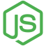

# Dealership RESTful CRUD Node Server




## How to use
### `This project has a .env file for the MongoDB credentials which is not included in the GitHub Repo`
### 1. Download example & install dependencies

Install npm dependencies:

```javascript
cd into project
npm install
```


### 2. Run each npm script in package.json

```javascript
npm run start
```

# Project Requirements

## Mongoose as your data modeling tool
The models folder found [here](./models) include models for order, product, and user. Some example code is below.


```javascript
const Schema = mongoose.Schema;
const orderSchema = new Schema({
  products: [
    {
      product: { type: Object, required: true },
      quantity: { type: Number, required: true }
    }
  ],
  user: {
    email: {
      type: String,
      required: true
    },
    userId: {
      type: Schema.Types.ObjectId,
      required: true,
      ref: 'User'
    }
  }
});
```

## Cloud-based MongoDB as your data store

```javascript
const store = new MongoDBStore({
  uri: MONGODB_URI,
  collection: 'sessions'
});
```

## At least 3 endpoints to GET data from your server
GET requests are located in the [routes](./routes) which includes

[admin.js](./routes/admin.js)\
[auth.js](./routes/auth.js)\
[shop.js](./routes/shop.js)

```javascript
router.get('/', shopController.getIndex);

router.get('/products', shopController.getProducts);

router.get('/products/:productId', shopController.getProduct);
```

## At least 1 endpoint allowing user to update an item via PUT or PATCH HTTP verbs

```javascript
router.get('/edit-product/:productId', isAuth, adminController.getEditProduct);
```

## At least 1 endpoint allowing user to create an item via POST
POST requests are located in the [admin.js](./routes/admin.js) file

```javascript
router.post('/add-product', isAuth, adminController.postAddProduct);
```

## At least 1 endpoint allowing user to delete an item via DELETE
The DELETE product is found in the [admin.js](./routes/admin.js) file which is a post request which calls the postDeleteProduct controller

```javascript
router.post('/delete-product', isAuth, adminController.postDeleteProduct);

exports.postDeleteProduct = (req, res, next) => {
  const prodId = req.body.productId;
  Product.findByIdAndRemove(prodId)
    .then(() => {
      console.log('DESTROYED PRODUCT');
      res.redirect('/admin/products');
    })
    .catch(err => console.log(err));
};
```